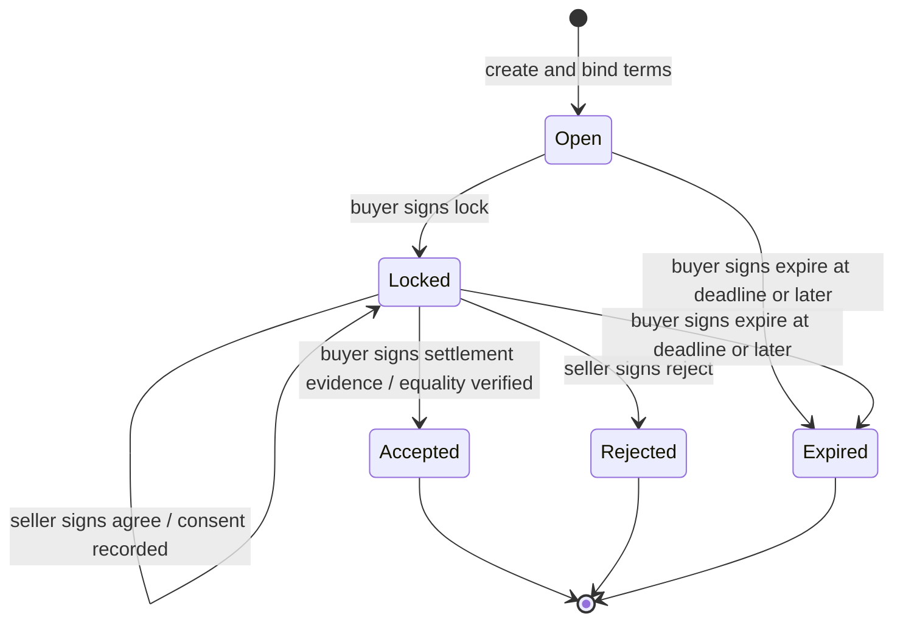
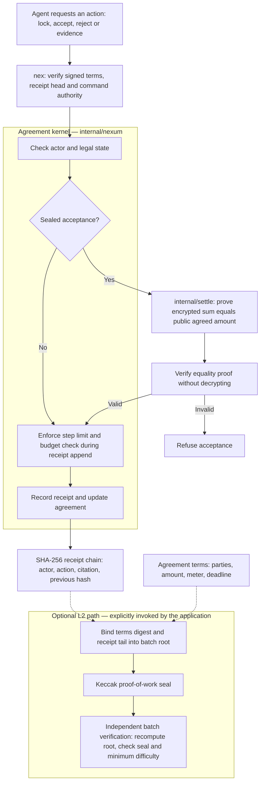
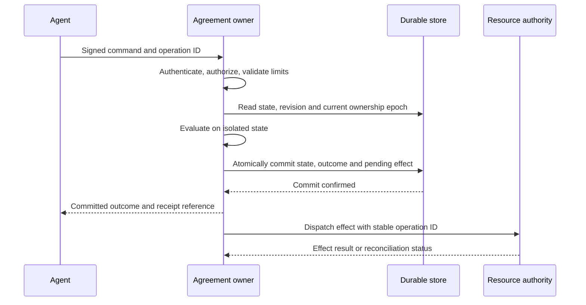

# Nexum: kernel, agreement lifecycle and secure deployment

Design review draft. **Implemented** describes the current kernel and `nex`
client. **Deployment requirement** describes what an operator must supply.
**Proposed** describes interfaces or guarantees that still require engineering.
These distinctions matter: the current implementation is an embedded library,
not a ready-to-run durable agreement service.

## 1. The kernel's job

A Nexum binds parties to terms and a permitted sequence of actions. An agent
proposes or authorizes an action; the kernel decides whether that transition is
legal for the current agreement. Evidence, acceptance and terminal decisions
become receipt history. Once a terminal transition succeeds, the supported
transition methods do not reopen that agreement.

The kernel operates on program state. It does not execute an agent's prose,
verify the truth of arbitrary evidence, provision compute, transfer bank funds
or turn a signature into permission to run a tool. Those effects belong to an
application adapter that owns the relevant resource and enforces the agreement.

**Nexum** names the framework. **nex** names its public client. The intended
public import is `github.com/WillBeebe/nexum/nex`. An application embeds that
client in its own infrastructure; no hosted Nexum account is required.

The trust boundary has three parts:

- **Agent:** holds its signing authority and authorizes explicit commands.
- **Agreement owner:** authenticates commands, serializes transitions and owns
  the authoritative state. The current local client runs in this process.
- **Resource authority:** controls the actual asset, capability or work. It
  acts only on an authorized, committed outcome, according to application policy.

One organization may operate all three, but their authority should remain
explicit. Homomorphic arithmetic does not remove trust in the current agreement
owner, which holds keys and can inspect or alter local memory.

## 2. Agreement data and binding

### Terms and mutable state

| Element | Current representation | Meaning |
|---|---|---|
| Parties | Buyer/seller public identities in `nex`; `Party` identifiers in the kernel | Roles authorized to act; identifiers alone are not authentication |
| Obligation | Kind, amount and application `spec` | What is being agreed; a kind string does not install a new evaluator |
| Meter | CostUSD, Effort, BudgetUSD, MaxSteps | Caller-supplied accounting and a step bound |
| Time | Creation time and deadline | Application-supplied time interpreted by transition checks |
| Lifecycle | Status, lock/close timestamps, ReleasedTo | Current outcome; assignment is not an external funds transfer |
| Evidence | Receipt notes and command Evidence | References/assertions whose meaning the application verifies |
| History | Ordered receipts and current head | Local integrity chain, not independent consensus |
| Encrypted lock | Paillier ledger, sealed partials and aggregate | Additive amount verification with local key custody |
| Consent | Private `nex.Contract.agreed` flag plus evidence receipt | Seller consent required by this client before buyer-authorized settlement |

The public constructor hashes kind, buyer ID, seller ID, amount, specification,
creation time and deadline together. The result identifies the agreement and
binds subsequent signed commands to those terms. Identical serialized terms
produce the same ID: there is no independent instance nonce in this API. An
application that wants two otherwise identical obligations must distinguish
those instances in the terms; a future protocol should make this explicit.

The core's exported structs are mutable. The stronger policy boundary is the
client's private agreement object and the host that owns it. Code that bypasses
that boundary can change fields directly. Public key byte slices also require
immutable ownership; callers must not retain a writable alias that can change
an admitted identity during execution.

### Terms are fixed by the client, not universally by every core method

The public client fixes the deadline at construction and exposes no amendment
method. The lower-level `SetDeadline` method allows either party to set a future
deadline before terminal state, including after lock. It does not require joint
consent. Therefore deployments must not expose arbitrary low-level methods as
remote operations. A jointly signed amendment protocol is future work.

## 3. Public client contract

The initial API is deliberately small and experimental:

```go
NewIdentity() (Identity, error)
New(kind string, buyer, seller Public, amount int64, spec any,
    now, deadline time.Time) (*Contract, error)

(*Contract).Command(action, evidence string) Command
(*Contract).Apply(command Command, signature []byte, now time.Time) error
(*Contract).Execute(identity Identity, action, evidence string, now time.Time) error
(*Contract).ID() string
(*Contract).Head() string
(*Contract).Status() Status
(*Contract).VerifyReceipts() error
```

`Execute` is a local convenience: it signs a command and invokes `Apply`. A
remote integration would construct/sign on the agent side and send the command
and signature to an authoritative owner. No such transport or ownership protocol
ships in this release. A signature alone does not sandbox a tool or perform work.

`New` binds kind, parties, amount, application specification, creation time and
deadline into a SHA-256 digest of a JSON struct. It creates an actual kernel
agreement, fixes the deadline and arms a 2048-bit Paillier ledger. The digest is
the agreement ID and command terms commitment. The client sets a 128-step bound.

`spec` must be JSON-serializable; `New` returns an error when specification
encoding fails. It retains the complete immutable definition for durable storage.
The standalone `Hash` helper still panics on encoding failure. Cross-language
canonical encoding remains API work.

Identity types expose byte slices. Callers must treat keys and admitted public
identity records as immutable and keep private material out of serialization
and logs. The contract constructor now owns copies of admitted public key
records. Stronger private key-handle APIs remain separate work.


## 4. Agreement lifecycle and command authorization

### Two-party lifecycle through nex



`agree` records consent while leaving the agreement locked. It is not the
terminal `Accepted` state. Settlement makes that terminal transition after
consent and evidence. A lock in this implementation is recorded accounting
state and ciphertext; the resource authority must make the actual reservation.

| Command | Signer selected by nex | Checks and transition |
|---|---|---|
| `lock` | Buyer | Open and within the time window; seal the full committed amount and become locked |
| `agree` | Seller | Locked, not previously agreed, within window; append consent evidence and set consent flag |
| `settle` | Buyer/verifier | Locked, seller consent, nonempty evidence, within window; append evidence then invoke sealed kernel acceptance |
| `reject` | Seller | Within window; kernel requires locked state and records terminal rejection |
| `expire` | Buyer | Deadline reached; kernel requires open/locked state and records terminal expiry |

The client authorizes a kernel seller-accept operation only after seller consent
and the buyer's signed settlement evidence. Evidence must represent a result
checked by the application. The kernel cannot distinguish an honest verifier
from a malicious one that signs a false assertion.

### Exact validation order

A command contains `Terms`, `Head`, `Action` and `Evidence`. The signature is
Ed25519 over a domain prefix followed by the hexadecimal SHA-256 hash of the
JSON command. The current domain is `nex-example/v1/contract/`; it is a historical
wire value, not an architectural dependency. Preserve it until an explicit
protocol-version migration is defined.

`Apply` executes these checks in order:

1. Select seller for `agree`/`reject`, otherwise buyer, and verify its signature.
2. Require the command's terms commitment and prior head to equal this Contract.
3. For `expire`, invoke the kernel's expiry check immediately.
4. For other actions, require creation time <= supplied time < deadline.
5. Check action-specific consent/state/evidence and invoke the kernel operation.

A successful command normally changes the head, so replaying its previous
signed command is refused as stale by the in-memory API. The optional `Store`
adds a signed `Operation` ID and durable success-result lookup: exact retries
return their original result, even after restart or a later command. Reusing
an ID with different content is refused. See [durable agreements](DURABLE_AGREEMENTS.md).
Unknown actions are refused. Expiry is explicit, not a background
transition; crossing the deadline does not mutate state on its own.

### Core operations beneath the client

`OpenAgreement` initializes the final contract kind and checks distinct nonempty
parties and positive amount. `OpenEscrow` retains the house-escrow example and
its original opening receipt. The unsealed
path is buyer `Lock`, then seller `Accept` or `Reject`. The sealed path first
arms a ledger with `StartSealed`; `Apply(seal)` encrypts positive partial amounts
and maintains their aggregate. Sealed `Apply(accept)` proves/checks equality to
the committed amount before changing the outcome.

Direct `Accept` and `Apply(accept)` use the same sealed proof check when a
ledger is armed. Direct `Reject` also dispatches to the sealed path. Lower-level expiry
allows either party, while this client restricts its expiry command to the buyer.
The direct accept/reject methods do not enforce deadline windows; that policy
is supplied by the client.

“No takeback” means that the allowed transition API refuses reversal. It does
not mean a malicious operator cannot replace memory or restore an old backup.
Protecting against that requires authoritative history and anti-rollback rules.

### Kernel execution and optional batch verification

This is the execution path beneath the client authorization layer. For sealed
acceptance, the kernel checks the encrypted sum against the public committed
amount before recording acceptance. Other operations follow their own state
checks without that equality-proof step.



Actor/state failures and failed metering checks also refuse the operation; they
are omitted from the diagram to keep the successful path readable. The metering
check shown applies to this agreement path and is not a CPU or memory quota.
Failed agreement commands preserve state: settlement stages evidence and
acceptance together, and sealing stages encryption randomness before committing.
Section 6 details the in-memory scope of this guarantee.

The L2 arrows are optional: `nex` does not automatically batch or seal a command.
Independent batch verification checks the supplied history and proof-of-work
against a verifier-selected difficulty floor. It is not a consensus protocol or
proof that the application's evidence is true. The ledger owner still holds
Paillier keys even though equality verification does not decrypt.

## 5. Other kernel agreement shapes

These state machines are implemented, but authenticated public `nex` adapters
for them are not yet supplied. Exposing raw actor strings would omit identity
verification; a service must provide an authorization layer first.

### Council: requirements, unanimous consent, execution

A council contains 3–7 distinct parties, requirements assigned to holders and
a named decision. Only the holder can satisfy its requirement, with a citation.
A party can opt in after its own requirements are satisfied. `ready` means all
requirements are satisfied; it does not itself mean unanimous consent.

Any participating actor can execute only when every requirement is satisfied
and every party has opted in. Execution records a terminal `executed` outcome.
A party can instead refuse before terminal state, producing `refused`. Recording
execution does not run the named decision in external infrastructure.

### Delegation: claim, proof, reward

A parent offers a task and reward to an intern. The intern claims, then submits
a nonempty proof citation. The parent accepts that proof to record terminal
`paid`, or rejects from claimed/proven state to record terminal `rejected`.
The parent may cancel only while the task is still offered. Once claimed, a
cancellation attempt is refused. The `paid` status assigns the recorded reward;
a separate custody adapter must perform any real transfer.

### Workflow: facts select a deterministic path

A workflow names a root, an authorized actor and gate/action nodes. A gate picks
the first child, in listed order, whose required facts are true. Walking detects
missing paths and loops. Executing records the selected path/action and becomes
terminal. Missing or false facts cannot satisfy a requirement. The workflow
trusts supplied facts; verification of those facts belongs to the host.

## 6. Receipts, metering and failure semantics

### Receipt guarantees

Each receipt contains sequence, time, action, actor, note, previous hash and
current hash. `VerifyReceipts` checks sequencing and hash consistency. It does
not replay policy, verify a portable set of signed commands, or prevent an owner
from replacing and rehashing the entire chain. The current receipt hash encoding
also needs a canonical-format review before it is a stable cross-language wire
contract.

The public client exposes a head and verification operation, not a complete
signed receipt export/import API. For independent verification, the proposed
receipt bundle must bind canonical terms, original commands/signatures,
resulting transitions, the expected previous head and the relevant public keys.
Sensitive evidence can be represented by commitments and controlled references;
its plaintext need not enter the general-purpose audit stream.

Local L2 primitives bind terms and receipt tails into a Keccak root and verify
proof-of-work headers. They are not automatically invoked by `nex`. They do not
supply owner election, replicated state, durable finality or an operating GPU
mesh. Anchoring a head only helps if the verifier independently trusts the anchor.

### Metering is not an infrastructure limit

Cost, effort, budget and maximum steps describe agreement accounting. The
client sets a 128-step bound. Core escrow/council/delegation compare the supplied
cost with a positive budget during receipt append; workflow append enforces its
step bound. These fields do not measure CPU, memory, actual inference charges or
cluster-wide spending. Applications need separate resource quotas and durable
budget reservations where multiple agreements share a budget.

### Atomic agreement commands

Agreement receipt append checks limits before consuming a step. Sealing stages
a separate copy of encryption randomness and computes the aggregate before
committing the receipt, locks and ledger. Client settlement uses
`AcceptWithEvidence`, which stages evidence and acceptance together; a failed
proof or step/budget check leaves the receipt head, status and meter unchanged.

The staged settlement copies the receipt slice. It shares the ledger only for
read-only proof operations; sealing separately copies mutable ledger randomness.
This is a narrowly scoped transition implementation, not a general snapshot API.
Callers must still serialize access across the entire command.

These kernel guarantees cover in-memory bilateral agreement operations. The
optional `Store` adds versioned encrypted checkpoints and commits state plus
successful operation results together across local process restarts. It does
not add transactional external effects or change council/delegation/workflow
semantics. The original `Contract` object remains memory-only.

## 7. Cryptography and custody

### Agent identities and encrypted artifacts

An identity has Ed25519 signing and X25519 encryption keys. Public identity IDs
commit to the complete public record. Validation checks key sizes and rejects
low-order X25519 inputs. Identity admission and trust remain the application's
responsibility; there is no public number registry in the candidate.

`Seal` encrypts a UTF-8 artifact with a fresh AES-256-GCM content key and signs
the envelope. The content key remains with the sender. `Decide` signs recipient
consent to the envelope hash. `WrapKey` verifies consent and wraps the content
key for that recipient using X25519/HKDF-SHA256/AES-256-GCM HPKE. `Open` verifies
the linked record before decrypting. The implementation uses Cloudflare CIRCL
for HPKE and Go cryptographic libraries for supporting operations.

The envelope codec also retains the existing legacy empty-suite path for
compatibility. New `Seal` calls select HPKE. The public build rejects unsupported
key suites and excludes the private experimental rekey algorithm. It does not
claim post-quantum authentication, forward secrecy or secure deletion.

Consent gates receipt of this envelope; it is not consent to hidden contents.
Once a recipient has plaintext, no contract can revoke that knowledge or enforce
later use cryptographically. A signed usage condition is an acknowledgment, not a technical restriction
on copying after decryption.

### Additive settlement

`EncryptedLedger` encrypts positive integer locks with Paillier, aggregates
ciphertexts and constructs/verifies an equality proof against a public amount.
The proof-checking arithmetic uses the public key; the owning ledger still
holds the private key and encryption randomness. Local custody sees plaintext
on input. The accept path avoids decrypting, but the host can inspect or decrypt.

This is additive homomorphic encryption, not a fully encrypted agreement state
machine. Actors, status, deadlines and policy branches remain ordinary program
state. The implementation uses `math/big`, is not constant-time, and has not had
an independent cryptographic audit. Benchmarks or passing tests are not a proof
of cryptographic security. Equality verification does not itself prevent replay
of the same proof; the surrounding contract enforces one-time settlement.

## 8. Deploying within your infrastructure

### What can be hosted today

**Implemented:** embed `nex` in a trusted Go process on your infrastructure.
Use the in-memory `Contract` for disposable state, or `Store` for local durable
bilateral agreements. Store serializes separate handles/processes with OS locks,
restores exact custody state, and makes successful operation retries stable.
Supply trusted time and protect the storage key separately. This does not
provide multi-host automatic failover.

**Deployment requirement:** place that process behind your application's
identity and authorization boundary. Do not allow arbitrary third-party plugins
or model-generated code to run in the same process with its keys and mutable
agreements. Give work execution separate process/container isolation and only
the specific resource capabilities that its authorization permits.

A Kubernetes Deployment, additional replicas or a database mounted beside the
process does not add a distributed ownership protocol. Store is a local
filesystem library, not a production server or multi-host database adapter.
The remainder of this section separates local durability from the stronger
service contract still needed for external effects and failover.

### Identity, ingress and authorization

Use an authenticated encrypted transport for remote submission. Validate the
service identity; use mutual TLS where appropriate for service peers. Bind the
authenticated tenant to allowed agreement IDs and admitted signing keys, then
verify the signed command independently. TLS authenticates the connection;
agreement signatures authorize the specific action. [OWASP TLS guidance](https://cheatsheetseries.owasp.org/cheatsheets/Transport_Layer_Security_Cheat_Sheet.html).

Validate body size, supported command/schema version and field lengths before
cryptographic work. Reject unknown methods and cap outstanding requests per
tenant and agreement. Never map request-provided `actor`, deadline, key material
or cost directly into mutable kernel fields. Authenticate reads as well as
writes: agreement metadata and evidence references can be sensitive.

For remote callers, use `Apply` with a supplied signature. Do not upload an
agent's private key to use `Execute`; that method is a local signing convenience.
Key rotation/revocation requires a versioned admission policy. A valid signature
under an old key cannot substitute for checking current authority. The current
client fixes its public identities at construction and has no rotation protocol.

### Keys and process privileges

Keep identity keys, content keys, Paillier keys and blinding factors out of
images, source control, diagnostic dumps, logs and general telemetry. Provision
secrets through an access-controlled secret manager, with workload-specific
permissions and explicit rotation/recovery procedures. Restrict filesystem,
debugging, outbound network and administrative access to the agreement owner.
[OWASP secrets-management guidance](https://cheatsheetseries.owasp.org/cheatsheets/Secrets_Management_Cheat_Sheet.html).

A secret manager protects storage and delivery; it does not stop the running
process from reading keys it must use. Current key APIs hold byte slices and
`math/big` values in process memory. Hardware-backed signing and separate
cryptographic custody would require new interfaces; they cannot be enabled by
merely changing a configuration flag. The current Paillier implementation is
unaudited and not constant-time. Do not claim isolation from a compromised host.

### One writer, ordered commands and a trusted clock

Route each agreement to exactly one current owner. Hold the ownership/serialization
boundary across reading state, checking the head, applying the command and
publishing its result. A lock around just one kernel method is insufficient.
Commands signed against the same head compete: after one advances the agreement,
another must be re-evaluated or rejected, not applied to an old copy.

Use the owner's clock for admission. Callers may propose a deadline as a term,
but must not choose `now` for authorization. Monitor skew and clock rollback;
refuse time-sensitive writes when trusted time is unavailable. Persist relevant
time boundaries in any durable implementation. The current API accepts a
supplied timestamp and does not enforce a trusted clock or global monotonic time.

### Durable command protocol — local implementation and service extensions

The local `Store` now has a version-1 encrypted state representation and atomic
file-replacement boundary. It persists terms, exact agreement state, custody,
consent, metering, signed operations and their successful outcomes. The service
extensions below still require ownership epochs and pending external effects:

| Record | Required purpose |
|---|---|
| Terms and protocol version | Reconstruct exactly what parties signed, including unique instance identity |
| Agreement revision and ownership epoch | Refuse stale writes and obsolete owners |
| State and receipt history | Recover status, consent, meter/step state and head consistently |
| Protected cryptographic state | Recover ciphertexts, keys/references and proof randomness without leaking them |
| Authorized command and outcome | Resolve retries without repeating transitions |
| Pending external effects | Reconcile resource changes after failures |

Use an operation identifier bound to tenant, agreement and canonical command.
The service must reject reuse of the identifier with different content and
return the stored outcome for an exact completed retry. This behavior is an
implemented by Store in addition to the in-memory client's head-based refusal.
Tenant isolation and global ownership epochs remain adapter responsibilities.



This sequence is a **proposed service protocol**, not a deployed Nexum server.
The response must distinguish agreement commitment from confirmed completion
of an external action. Where resource reservation must precede a binding lock,
model reservation and its failure explicitly before committing that lock.

Commit with a revision/epoch check or equivalent serializable transaction. If
PostgreSQL is chosen, serializable conflicts require transaction retries; all
validation must be repeated against current state, and external effects must
not happen inside a transaction that may retry. PostgreSQL is an option, not a
new Nexum dependency. [PostgreSQL transaction isolation](https://www.postgresql.org/docs/18/transaction-iso.html).

Raw JSON serialization is not a persistence strategy: `nex.Contract` has private
fields and ordinary Agreement JSON excludes its ledger. Store uses an explicit
private checkpoint that preserves Paillier key material, proof randomness and
consumed steps inside authenticated encryption. Recreating the constructor or
replaying encryption with fresh randomness would change receipt heads; recovery
restores exact committed data instead.

### External effects and uncertain outcomes

Never treat `ReleasedTo`, `paid` or `executed` as evidence that an external
system completed its work. Commit an effect intent together with the agreement
outcome, then deliver it through a retryable worker. The destination must dedupe
by a stable operation ID or offer a reliable reconciliation query. If neither
is possible, a lost response is an unresolved outcome; do not blindly retry a
potentially irreversible action or report it completed.

Enforce resource-level limits where resources are actually controlled. For
compute, constrain process/container resources and accessible tools. For shared
budgets, reserve the budget atomically across agreements. For artifacts, verify
against immutable input/output commitments before authorizing settlement.

### Restart, backup and failover

Store-backed obligations resume from authenticated local checkpoints. Memory-only
obligations still cannot resume after process loss. A restarted instance must
not silently recreate missing or corrupt stored agreements. Keep the sender's
signed operation in an application-owned durable outbox until its result is known.

For the proposed durable service, restore state and cryptographic custody as a
consistent set. Verify schema/protocol versions and history before enabling
writes. Retain independent checkpoints where rollback detection is required;
loading an old but internally valid backup must not resurrect terminal work.

Horizontal ownership requires a monotonically increasing epoch enforced at
both the state store and resource authority. A timeout is not proof the old
owner stopped. Fence the old epoch before permitting a replacement to act; if
ownership cannot be established, refuse writes. Reads from replicas must disclose
their revision and must not authorize effects using stale state.

### Operational observability and upgrades

Record aggregate refusal rates, latency, queue depth, ownership changes, clock
health and unresolved effects. Keep authorized agreement audit records separate
from routine logs. Do not dump commands, specifications, evidence text or identity
objects into telemetry. Any agreement identifiers in logs need an explicit
access and retention policy.

Pin the deployed version and dependencies. Preserve protocol and storage version
compatibility for in-flight agreements. Before an upgrade, drain new work or
migrate ownership explicitly; test recovery on representative encrypted state.
A rollback of binaries is not permission to roll back agreement history.

## 9. Deployment readiness and acceptance

| Capability | Current state | Required before a stronger service claim |
|---|---|---|
| Signed two-party transitions | Implemented in nex | Ingress admission, tenant policy and trusted time |
| Concurrent agreement owner | Store serializes local handles/processes | Distributed ownership and fencing |
| Atomic rejection | Bilateral kernel and Store preserve state on failed commands | External-effect transactions |
| Durable recovery | Versioned encrypted Store; tested process-crash recovery | Key management, backup and anti-rollback policy |
| Reliable retries | Signed IDs, durable outcomes and conflict refusal in Store | Sender outbox and external-effect reconciliation |
| Real resource enforcement | Application responsibility | Reservations, deduplicated effects and reconciliation |
| Failover | No ownership protocol | Fenced epochs and anti-rollback recovery |
| Independent audit | Local hash-chain checks | Signed portable history and trusted checkpoints |

Before exposing a durable service, exercise: two commands against one head;
failed proof after evidence append; crash before and after commit; response loss
after commit; replay after restart; stale owner dispatch; clock rollback; revoked
signer; resource action with a lost response; restore of an old backup; and
upgrade with active encrypted agreements. Each test must establish the resulting
state and external effect, not merely that a request returned an error.

## 10. Decisions for kernel review

1. Extend local versioned storage with migration, anti-rollback and ownership fencing.
2. Specify canonical signed bytes, domain/version rules and unique instance IDs.
3. Define jointly authorized amendments, identity changes and expiry authority.
4. Expose a portable signed receipt bundle with explicit verification guarantees.
5. Decide the boundary between local cryptographic custody and remote evaluation.
6. Add authenticated client adapters for council, delegation and workflow.

These decisions govern the kernel and its deployment contract. Packaging and
release mechanics are documented separately so they do not obscure the agreement
semantics reviewed here.
